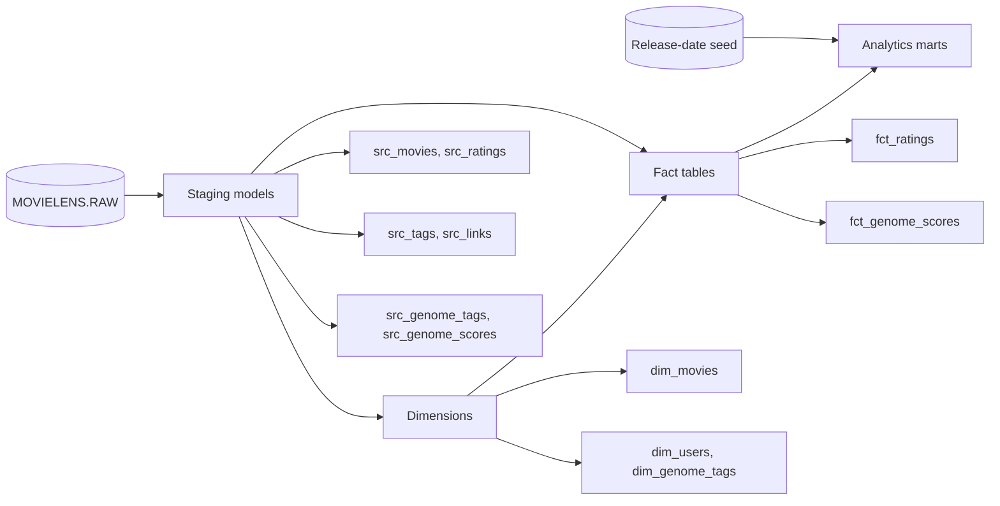

# MovieLens

MovieLens is a dbt project that transforms MovieLens movie, rating, tag,
link, and genome data into analytics-ready models in Snowflake.


## Overview

The project turns raw MovieLens files into reusable relational models for movie
catalog analysis, user activity, rating analysis, and genome-tag exploration.
The transformation flow separates source cleanup from business-facing facts and
dimensions, making individual parts of the pipeline easier to test and rebuild.

## Architecture



## Project Structure

The project is organized into four layers:

- `models/staging/`: Renames raw columns and applies basic type conversions.
- `models/dim/`: Builds movie, user, and genome-tag dimensions.
- `models/fct/`: Builds rating and genome-score fact tables.
- `models/mart/`: Provides analysis-ready outputs, including movie release-date
	status.
- `seeds/`: Stores project-managed reference data such as movie release dates.
- `tests/`: Holds custom dbt tests when they are added.

Important models include:

| Model | Purpose |
| --- | --- |
| `src_ratings` | Converts raw rating timestamps and standardizes rating columns. |
| `dim_movies` | Cleans movie titles and exposes genres as an array. |
| `dim_users` | Creates a distinct user dimension from activity data. |
| `fct_ratings` | Stores user ratings and incrementally loads newer records. |
| `fct_genome_scores` | Stores movie-to-genome-tag relevance scores. |
| `mart_movie_releases` | Adds release-date status to the rating output. |

## Data Sources

The models expect a Snowflake database named `MOVIELENS` and a `RAW` schema.
The source declaration in `models/sources.yml` exposes these raw tables:

| dbt source | Physical table |
| --- | --- |
| `movielens.r_movies` | `MOVIELENS.RAW.RAW_MOVIES` |
| `movielens.r_ratings` | `MOVIELENS.RAW.RAW_RATINGS` |
| `movielens.r_tags` | `MOVIELENS.RAW.RAW_TAGS` |
| `movielens.r_genome_tags` | `MOVIELENS.RAW.RAW_GENOME_TAGS` |
| `movielens.r_genome_scores` | `MOVIELENS.RAW.RAW_GENOME_SCORES` |
| `movielens.r_links` | `MOVIELENS.RAW.RAW_LINKS` |

`seed_movie_release_dates.csv` provides the optional `movie_id` to
`release_date` reference used by the release mart. Missing dates are labeled
`Unknown` by the mart model.

## Project Structure

The project is organized into four layers:

- `models/staging/`: Renames raw columns and applies basic type conversions.
- `models/dim/`: Builds movie, user, and genome-tag dimensions.
- `models/fct/`: Builds rating and genome-score fact tables.
- `models/mart/`: Provides analysis-ready outputs, including movie release-date
	status.
- `seeds/`: Stores project-managed reference data such as movie release dates.

Important models include:

- `src_ratings`: Converts the raw rating timestamp to a Snowflake timestamp.
- `dim_movies`: Cleans movie titles and exposes genres as an array.
- `dim_users`: Creates a distinct user dimension from ratings.
- `fct_ratings`: Filters null ratings and incrementally loads newer ratings.
- `mart_movie_releases`: Combines ratings with seeded release-date information.

## Data Sources

The models expect a Snowflake database and schema named `MOVIELENS` with raw
data available under `MOVIELENS.RAW`. The project currently references raw
ratings from `MOVIELENS.RAW.RAW_RATINGS` and movie data through the dbt source
`movielens.r_movies`.

Configure a dbt profile named `netflixmovielens` in your local `profiles.yml`.
Keep credentials and account-specific settings out of this repository.

### Prerequisites

- Python with dbt installed
- The dbt adapter required by your Snowflake environment
- Access to the `MOVIELENS` database and `RAW` schema
- A configured `netflixmovielens` target in `profiles.yml`

## Getting Started

From the `netflixmovielens` directory:

```bash
dbt debug
dbt seed
dbt run
dbt test
```

Run `dbt seed` before building marts that depend on the release-date seed.

Useful focused commands:

```bash
dbt run --select src_ratings
dbt run --select fct_ratings
dbt run --select mart_movie_releases
dbt test --select fct_ratings
dbt docs generate
dbt docs serve
```

To inspect the dependency graph and generated SQL, use:

```bash
dbt ls --select fct_ratings+
dbt compile --select fct_ratings
```

Because `fct_ratings` is incremental, a normal run processes rows whose
`rating_timestamp` is newer than the current maximum in the target table. To
rebuild it from the source, use:

```bash
dbt run --full-refresh --select fct_ratings
```

## Configuration

The project defaults to views. Dimension and fact directories are configured
as tables in `dbt_project.yml`; model-level configuration can override those
defaults. Incremental models use `on_schema_change='fail'` so unexpected schema
changes stop the build instead of silently changing the target table.

## Data Quality

The model properties in `models/schema.yml` check important identifiers and
relationships, including:

- Non-null and unique movie identifiers in `dim_movies`
- Non-null and unique user identifiers in `dim_users`
- Non-null rating keys and movie-to-dimension relationships in `fct_ratings`
- Non-null genome tag keys and relevance scores in `fct_genome_scores`

Run all configured checks with `dbt test`, or select a model while developing:

```bash
dbt test --select dim_movies
dbt test --select fct_genome_scores
```

## Troubleshooting

| Symptom | Suggested action |
| --- | --- |
| Profile or connection error | Run `dbt debug` and verify the `netflixmovielens` profile. |
| Missing source table | Confirm the `MOVIELENS.RAW` tables and source identifiers exist. |
| Incremental model misses older rows | Use `dbt run --full-refresh --select fct_ratings`. |
| Schema-change failure | Review the target schema and update the model deliberately before rerunning. |

## Useful dbt Resources

- [dbt documentation](https://docs.getdbt.com/docs/introduction)
- [dbt source definitions](https://docs.getdbt.com/docs/build/sources)
- [dbt incremental models](https://docs.getdbt.com/docs/build/incremental-models)
